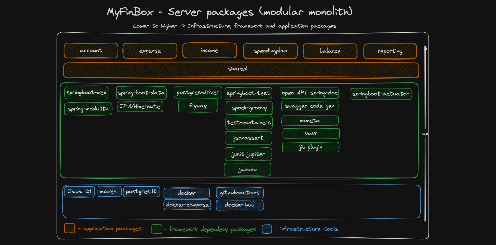

# Server - modular monolith service for serving app REST API requests 

---
### Application tools and packages:



---

### Environment Variables _(:default)_

* `SERVER_PORT` - server port run _(:8080)_
* `POSTGRES_HOST` - postgres database host _(:localhost)_
* `POSTGRES_PORT` - postgres database port _(:5432)_
* `POSTGRES_DB_NAME` - postgres database name _(:myfinboxdb)_
* `POSTGRES_DB_USER` - postgres database user _(:application)_
* `POSTGRES_DB_PASSWORD` - postgres database password _(:secret)_
* `FLYWAY_POSTGRES_DB_USER` - flyway postgres database user _(:application)_
* `FLYWAY_POSTGRES_DB_PASSWORD` - flyway postgres database password _(:secret)_

---

### Docker Image Build

#### Docker image destination

* It builds image taged with _:latest_ and git _:sha_

* Configure the plugin by setting the image to push to:

##### Using [Docker Hub Registry](https://hub.docker.com/)

Make sure you have a [docker-credential-helper](https://github.com/docker/docker-credential-helpers#available-programs)
set up. See [jib-doc](https://github.com/GoogleContainerTools/jib/tree/master/jib-maven-plugin#configuration)

### Build your image

```console
% ./mvnw compile jib:build -Dimage=docker.io/motpansergiu/myfinbox-server
```

### Build to Docker (local) daemon
```console
% ./mvnw compile jib:dockerBuild -Dimage=docker.io/motpansergiu/myfinbox-server
```
---

### Local Development Additional Tools:

#### Required Tools

* `Java 21`
* `Docker`, `Docker-Compose`

#### Run locally using mvn and docker-compose (default environment variables)
```console
% docker-compose up --build
```

* Using `spring-boot:run`
```console
% ./mvnw spring-boot:run -Dspring-boot.run.arguments="--SERVER_PORT=8080"
```

* Using `docker`
```console
% docker run --name myfinbox-server \
      -p 8080:8080 \
      --network myfinboxdb-network \
      -e POSTGRES_HOST=postgres \
      motpansergiu/myfinbox-server:latest
```
---
### Health Check
```console
% http://localhost:8080/api/actuator/health
```

---

### Swagger REST API Docs
```console
% http://localhost:8080/api/swagger-ui/index.html
```
